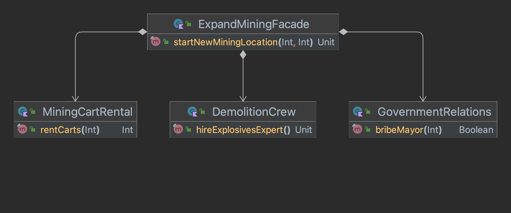

# Facade Pattern

## Goal:
1) A **structural** design pattern for realizing relationships in complex systems.
2) Provide a simplified interface to a set of subsystems.
3) Minimize callers direct dependencies on multiple subsystems
4) Promote encapsulation by "hiding" internal logic from the caller. 

## Characteristics:
1) A _facade_ which serves as a simplified interface / entrypoint that lies on top of other interfaces.
2) Usually the facade only delegates and forwards request from the caller.

## Useful when: 
1) Your business logic depends on multiple models and/or interfaces into product services.
2) A system is very complex or difficult to understand. Provides a sort of "birds-eye-view".
    

## Additional observations: 
1) Often abused / misused by simply naming an interface a facade and claiming adherence to the pattern.
2) Not always worth adding a layer to your code.

_Note to self: Revisit this and update once I get a bigger brain_
